# Delonix Meet — Onboarding de Engenharia

> **Para o dev novo.** Este documento leva-te do zero a "consigo dar manutenção com
> confiança": mapa do código, arquitetura em **C4** (Contexto → Contentor →
> Componente → Código), **UML 2** (classes, componentes, sequência, estado,
> deployment), modelo de dados (ER), um **flowchart do system design** e receitas
> para mudanças típicas. Os diagramas são **Mermaid** (renderizam no GitHub/IDE).
>
> Lê primeiro o [README](../README.md) (arranque) e o [HARNESS.md](../HARNESS.md)
> (contexto de produto + invariantes). Regressões a **não** reintroduzir:
> [docs/reference/regressions.md](reference/regressions.md).

---

## 0. Primeiros 30 minutos

```bash
make dev          # infra + backend + frontend; abre http://localhost:5173
make logs         # segue os logs
make test         # fitness functions + cargo test + tsc + vitest
```

1. Abre a app em duas janelas, cria uma sala, entra nas duas → vê a media a fluir.
2. Segue o §5 (flowchart) com a app aberta para ligar o que vês ao que corre.
3. Quando fores mexer em algo, salta para o §9 (receitas) e o §10 (onde procurar).

**Modelo mental em 3 frases:** um **único binário Rust** (`delonix-server`) serve
API REST + WebSocket de sinalização + um **SFU WebRTC** próprio; uma **SPA React**
fala com ele por HTTPS/WSS e troca media por SRTP/DTLS (relay via coturn quando
preciso). **Postgres** guarda tudo; **Redis** propaga presença/sinalização entre
réplicas; o SFU é **in-memory por processo** (daí a afinidade por sala em K8s).

---

## 1. Mapa do monorepo

```
delonix-meet/
├── server/                 # backend Rust (axum + webrtc-rs + sqlx)
│   ├── src/                # um módulo por área (ver §3 C4-Componente)
│   └── migrations/         # sqlx, aplicadas no arranque (0001…)
├── web/                    # frontend React + TypeScript + Vite
│   └── src/                # pages/, + módulos de topo (api, signaling, webrtc, e2ee…)
├── deploy/                 # produção: nginx, systemd, docker-compose, ansible/, k8s/
├── docs/                   # esta doc, referência, ADRs, ops, regressões
├── scripts/                # fitness functions (docs-drift, room-affinity, tenant-rls)
└── Makefile · HARNESS.md    # orquestração + harness de contexto
```

Mapa detalhado dos módulos backend/frontend: `HARNESS.md` §2.

---

## 2. C4 — Nível 1: Contexto do sistema

Quem usa o Delonix e com que sistemas externos fala.

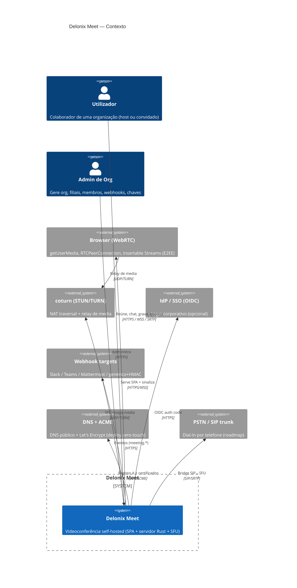

---

## 3. C4 — Nível 2: Contentores

Unidades executáveis. **`delonix-server` é um único binário** (não microserviços) —
por design (deploy simples, controlo do pipeline RTP para E2EE+gravação).

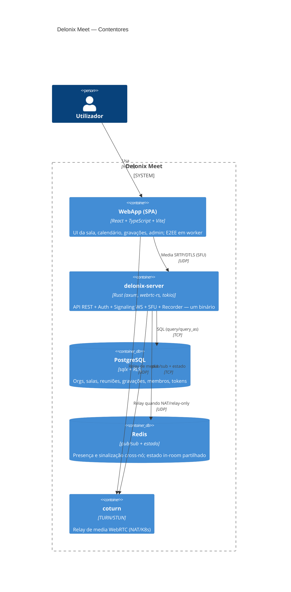

**Fronteiras de rede (nunca públicas):** Postgres e Redis só no loopback/interno;
o backend (`:8180`) atrás do nginx/ingress; só 443 (app/API/WSS) e coturn
(3478 UDP + range de relay) expostos. Ver [runbook §3.1](ops/platform-engineering.md#31-matriz-de-portas--firewall).

---

## 4. C4 — Nível 3: Componentes (dentro de `delonix-server`)

Cada componente = um módulo Rust em `server/src/`. Setas = dependência de chamada.

```mermaid
C4Component
  title delonix-server — Componentes (módulos Rust)

  Container_Boundary(s, "delonix-server") {
    Component(main, "main.rs", "bootstrap", "Router axum, AppState, cron (retention), wiring")
    Component(cfg, "config.rs", "config", "Env → Config; fail-closed sem segredos fortes")
    Component(err, "error.rs", "erros", "AppError → HTTP status + JSON")

    Component(auth, "auth.rs", "auth", "Registo (org+admin), login, refresh rotativo, room tokens, SSO")
    Component(org, "org.rs", "multi-tenant", "Orgs, filiais, membros, grupos, salas presenciais, quotas, stats")
    Component(rooms, "rooms.rs", "salas", "CRUD salas, can_access_room (isolamento), ice_servers")
    Component(sig, "signaling.rs", "WS /ws", "Transporte SFU + moderação + chat/breakouts")
    Component(tools, "room_tools.rs", "colaboração", "Sondagens, Q&A, timer, quadro (handle_tool_msg)")
    Component(sfu, "sfu.rs", "SFU", "Hub, Room, Publication, simulcast, PLI, RTP fan-out")
    Component(rec, "recorder.rs", "gravação", "RTP→IVF/OGG→ffmpeg; decrypt E2EE (key delegation)")
    Component(pres, "presence.rs", "WS /rtc", "Chamadas WhatsApp-style, ring de reunião")
    Component(meet, "meetings.rs", "calendário", "Reuniões, conflitos, quarentena, MoM, webhooks")
    Component(recs, "recordings.rs", "biblioteca", "Listagem, partilha read-only, sweep de retenção")
    Component(hooks, "webhooks.rs", "webhooks", "Fire best-effort + SSRF guard")
    Component(keys, "apikeys.rs", "API pública", "API keys (hash+scopes) + /api/v1")
    Component(rl, "rate_limit.rs", "abuso", "TokenBucket por IP/conta/socket")
    Component(met, "metrics.rs", "observabilidade", "Contadores atómicos → /metrics")
    Component(redis, "pubsub.rs / redis_state.rs", "Redis", "Entrega cross-nó + estado in-room")
  }

  ContainerDb(pg, "PostgreSQL")
  ContainerDb(rd, "Redis")
  Container(ct, "coturn")

  Rel(main, auth, "rotas")
  Rel(main, sig, "rota /ws")
  Rel(main, pres, "rota /rtc")
  Rel(sig, sfu, "offer/answer/ice")
  Rel(sig, tools, "delega tool msgs")
  Rel(sfu, rec, "frames p/ gravar")
  Rel(sfu, ct, "relay")
  Rel(rooms, ct, "credenciais TURN (HMAC)")
  Rel(auth, pg, "SQL")
  Rel(org, pg, "SQL (RLS)")
  Rel(meet, hooks, "dispara eventos")
  Rel(sig, redis, "fan cross-nó")
  Rel(pres, redis, "presença")
  Rel(main, met, "/metrics")
```

**Frontend (componentes espelhados)** — `web/src/`:

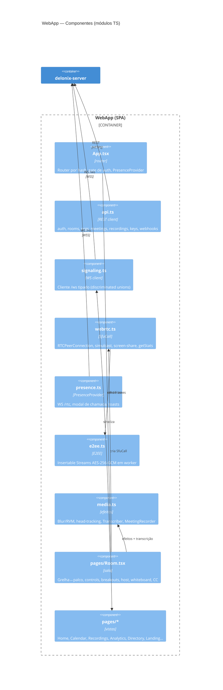

---

## 5. Flowchart do system design (request → media)

O caminho completo de um utilizador a entrar numa sala e a estabelecer media.

```mermaid
flowchart TB
  subgraph Client["Browser (SPA)"]
    UI[Room.tsx] --> API[api.ts]
    UI --> SIG[signaling.ts]
    UI --> RTC[SfuCall webrtc.ts]
    RTC --> E2EE[e2ee.ts worker]
  end

  subgraph Edge["Borda"]
    NGINX{{"nginx / ingress-nginx<br/>TLS · CSP · afinidade /ws por sala"}}
  end

  subgraph Server["delonix-server (Rust)"]
    AUTH[auth.rs] --> DB[(PostgreSQL)]
    ROOMS[rooms.rs] --> DB
    WS[signaling.rs] --> HUB[sfu.rs Hub/Room]
    HUB --> RECODER[recorder.rs]
    WS --> RS[(Redis)]
  end

  TURN[coturn STUN/TURN]

  API -->|"HTTPS /api/*"| NGINX
  SIG -->|"WSS /ws?token&room"| NGINX
  NGINX -->|REST| AUTH
  NGINX -->|REST| ROOMS
  NGINX -->|WS| WS
  RTC <-->|"SRTP/DTLS (UDP)"| TURN
  HUB <-->|"RTP relay"| TURN
  RTC -.->|"sfu-offer/answer/ice"| WS

  classDef ext fill:#eda33b22,stroke:#eda33b;
  class TURN,NGINX ext;
```

**Leitura:** REST autentica e autoriza (org-scoped); o WS `/ws` transporta a
sinalização SFU e a moderação; o `sfu.rs` faz o fan-out RTP; a media viaja
browser↔coturn↔SFU (relay-only quando NAT/K8s). Detalhe da media em K8s: R4.

---

## 6. UML 2 — Diagrama de classes (modelo de domínio)

Entidades principais e relações (simplificado; nomes = tabelas Postgres).

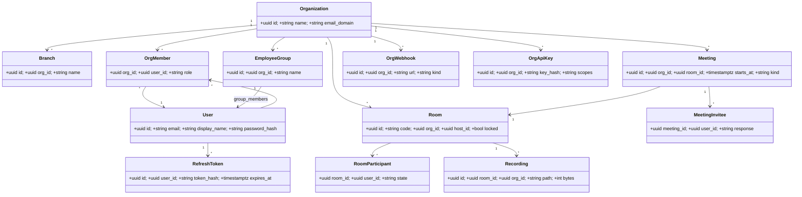

> **Invariante:** tudo é escopado à(s) org(s) do utilizador. `rooms::can_access_room`
> e `org::*` filtram por org; o **RLS** no Postgres é o backstop fail-closed
> ([ADR-0002](adr/0002-tenant-isolation-rls.md)).

---

## 7. UML 2 — Sequências (os 3 fluxos que tens de conhecer)

### 7.1 Autenticação (registo → refresh rotativo)

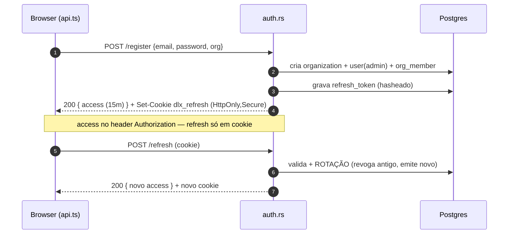

### 7.2 Entrar na sala + estabelecer media (SFU)

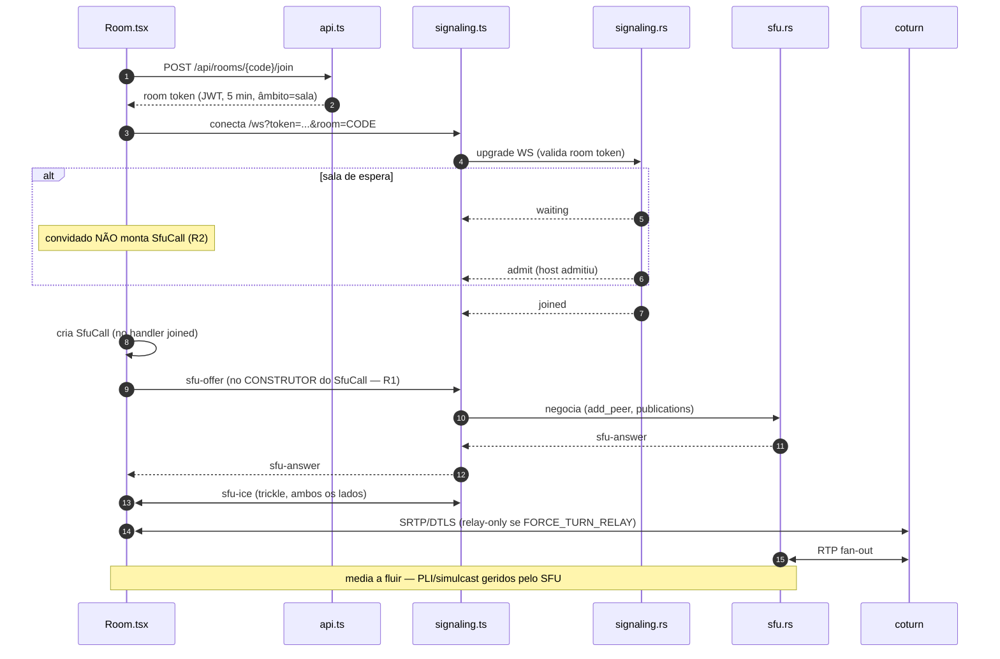

> **Regressões críticas neste fluxo:** R1 (oferta no construtor), R2 (não montar
> em espera), R3 (afinidade `/ws` por sala em K8s), R4 (relay hairpin). **Lê-as**
> antes de mexer em `webrtc.ts`/`signaling.rs`/`sfu.rs`.

### 7.3 Chamada estilo WhatsApp (presença)

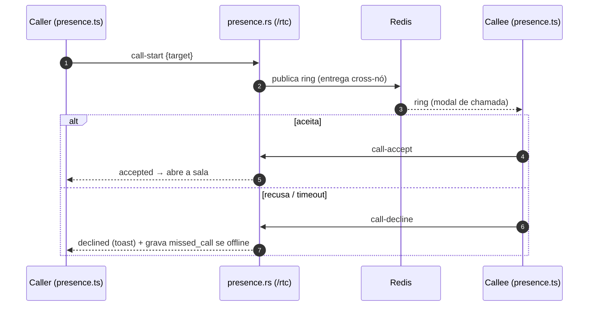

---

## 8. UML 2 — Estado & Deployment

### 8.1 Estado do participante numa sala

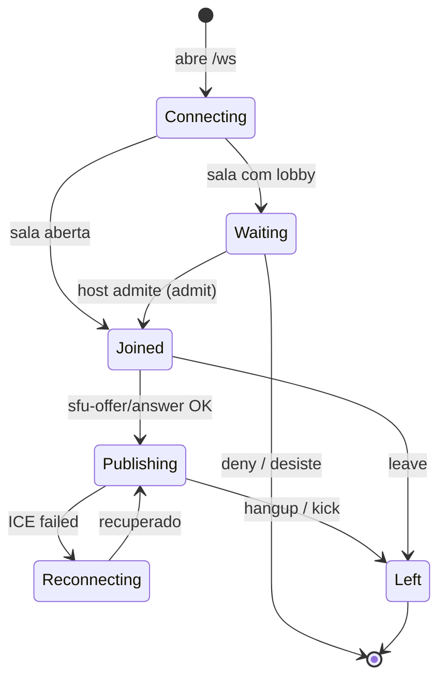

### 8.2 Deployment (single-host vs multi-host)

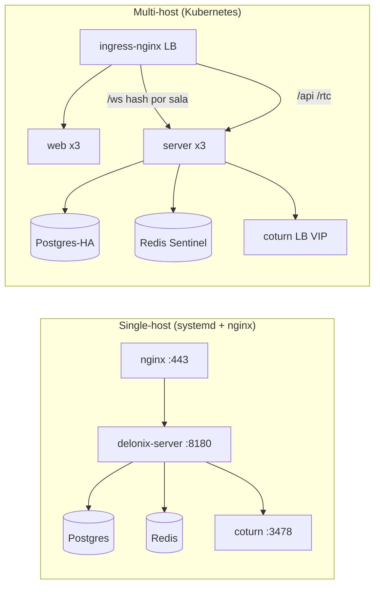

Deploy zero-touch (IP/DNS/TLS/segredos automáticos): [ops/zero-touch-deploy.md](ops/zero-touch-deploy.md).

---

## 9. UML 2 — Componentes & dependências (build)

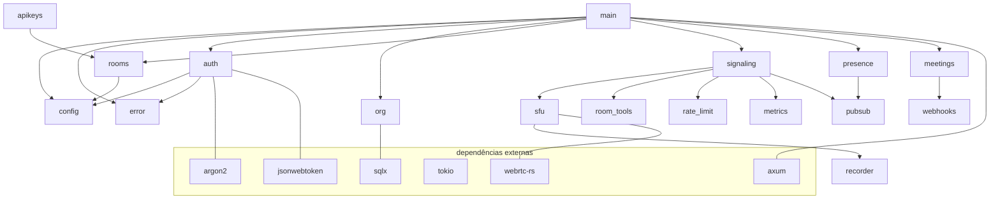

---

## 10. Modelo de dados (ER) — tabelas reais

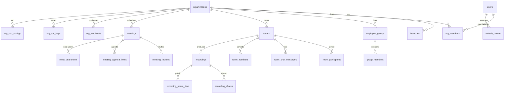

Outras tabelas: `action_items`, `action_plans`, `missed_calls`, `whiteboards`,
`meeting_rooms` (salas **físicas** ≠ `rooms` virtuais), `voice_*` (PSTN).
Migrações em `server/migrations/` — **aditivas**, corridas no arranque.

---

## 11. Concerns transversais (onde vivem)

| Concern | Onde | Regra |
|---|---|---|
| **Config** | [config.rs](../server/src/config.rs) | 12-factor; fail-closed sem segredos fortes |
| **Erros** | [error.rs](../server/src/error.rs) | `AppError` → status+JSON; **nunca `unwrap()`** em prod |
| **Auth** | [auth.rs](../server/src/auth.rs) | JWT access 15m + refresh rotativo (cookie HttpOnly); room token 5m |
| **Multi-tenant** | [org.rs](../server/src/org.rs), [rooms.rs](../server/src/rooms.rs) | tudo org-scoped + **RLS** backstop |
| **Abuso** | [rate_limit.rs](../server/src/rate_limit.rs) | TokenBucket (R6) — não voltar a janela fixa |
| **SSRF** | [webhooks.rs](../server/src/webhooks.rs) | validar host na criação E na entrega |
| **Observabilidade** | [metrics.rs](../server/src/metrics.rs) | `/metrics` Prometheus |
| **Cross-nó** | [pubsub.rs](../server/src/pubsub.rs), [redis_state.rs](../server/src/redis_state.rs) | Redis propaga sinalização/presença, **não RTP** |
| **E2EE** | [e2ee.ts](../web/src/e2ee.ts), [recorder.rs](../server/src/recorder.rs) | chave nunca vai ao servidor (exceto key delegation p/ gravar) |

---

## 12. Receitas de manutenção

**Novo endpoint REST**
1. Handler em `server/src/<modulo>.rs`: `async fn h(...) -> Result<impl IntoResponse, AppError>`.
2. Regista a rota em `main.rs` (dentro do grupo autenticado/org-scoped certo).
3. Escopa à org (`can_access_room`/`org_co_members`) — nunca devolver dados cross-org.
4. Cliente: adiciona a chamada em `web/src/api.ts`.

**Nova mensagem WebSocket**
1. Adiciona a variante ao enum `ClientMsg`/`ServerMsg` em `signaling.rs` (`#[serde(tag="type", rename_all="kebab-case")]`).
2. Trata no match; se for ação partilhada, o **servidor é autoritativo** (R7).
3. Cliente: adiciona à discriminated union em `web/src/signaling.ts`.

**Nova migração**
1. `server/migrations/00NN_descricao.sql` (aditiva). `touch server/src/main.rs` re-embebe.
2. `make migrate` (dev) ou arranque do servidor (auto). Rebuild release antes de restart (R9).
3. Se a tabela é multi-tenant, adiciona **RLS** (ver ADR-0002) e a fitness `check-tenant-rls.sh` cobre-a.

**Nova página**
1. `web/src/pages/Nova.tsx`; regista a rota por hash em `App.tsx`.
2. Tokens CSS (nunca cores hardcoded); i18n via `useTranslation()`.

**Antes de commit:** `make test` (fitness + cargo test + tsc + vitest). As fitness
functions falham o build se a doc/afinidade/RLS driftarem.

---

## 13. Glossário

| Termo | Significado |
|---|---|
| **SFU** | Selective Forwarding Unit — servidor que reencaminha RTP sem transcodificar |
| **Room token** | JWT de curta duração (5m), âmbito = 1 sala, exigido pelo `/ws` |
| **Afinidade por sala** | encaminhar todos os pares de uma sala para o mesmo pod (SFU in-memory) |
| **Key delegation** | host cede a chave AES ao servidor **só** para gravar E2EE |
| **RLS** | Row-Level Security do Postgres — backstop de isolamento multi-tenant |
| **Fitness function** | teste de arquitetura que falha o build se uma invariante driftar |
| **Sala virtual vs física** | `rooms` (reunião online) ≠ `meeting_rooms` (sala presencial) |

---

## 14. Para onde ir a seguir

- [docs/reference/architecture.md](reference/architecture.md) — referência estável
- [docs/reference/regressions.md](reference/regressions.md) — **R1–R12** (lê antes de mexer em media)
- [docs/reference/api-contract.md](reference/api-contract.md) — fronteira de API pública
- [docs/adr/](adr/) — decisões (afinidade por sala, RLS)
- [docs/ops/platform-engineering.md](ops/platform-engineering.md) — operação/produção
- [HARNESS.md](../HARNESS.md) — contexto de produto, invariantes, painel de revisores

*Diagramas em Mermaid — mantém-nos a par do código ao mudares módulos/rotas/tabelas.*
